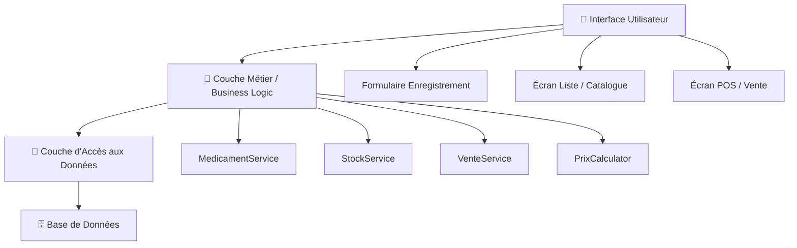
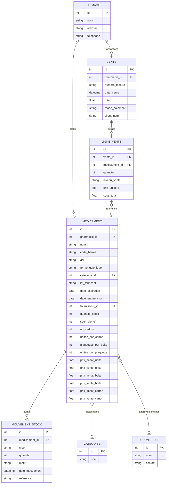
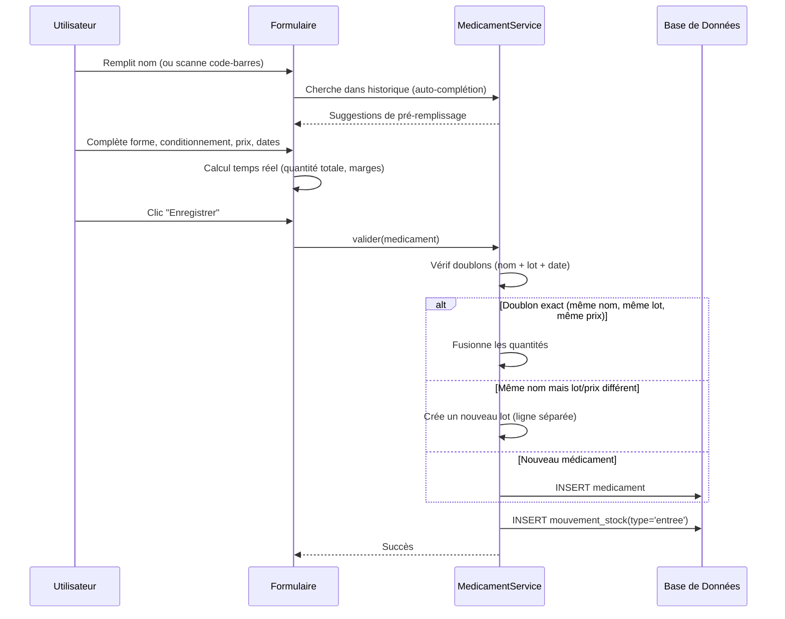
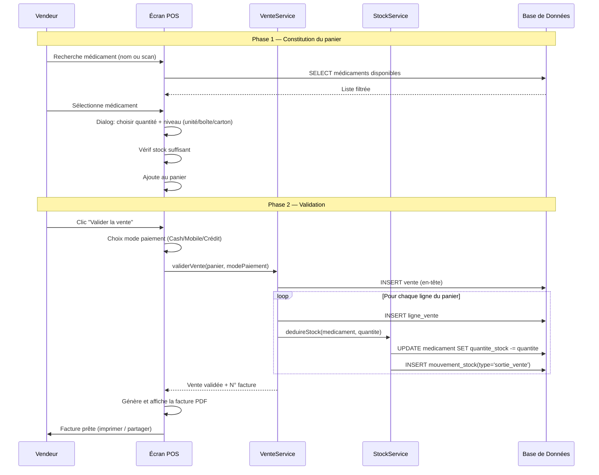

# 💊 Plan d'Implémentation — Logiciel de Gestion Pharmaceutique

> Blueprint générique pour intégrer 3 fonctionnalités clés dans n'importe quel logiciel de pharmacie

---

## 🏗️ Architecture Recommandée



### Schéma Relationnel Complet



---

## 1️⃣ Enregistrement d'un Nouveau Médicament

### Objectif

Permettre la saisie complète d'un médicament avec son conditionnement multi-niveau, ses prix, et ses métadonnées de traçabilité.

### Modèle de Données

| Champ | Type | Obligatoire | Description |
|-------|------|:-----------:|-------------|
| `nom` | String | ✅ | Nom commercial |
| `code_barres` | String | — | Code EAN/UPC (scanner) |
| `dci` | String | — | Dénomination Commune Internationale |
| `forme_galenique` | Enum | ✅ | Comprimé, Sirop, Injectable, Pommade… |
| `categorie_id` | FK | — | Antibiotique, Antalgique, Antipaludéen… |
| `lot_fabricant` | String | — | N° de lot du fabricant |
| `date_expiration` | Date | ✅ | Date de péremption |
| `date_entree_stock` | Date | ✅ | Date d'arrivée en stock |
| `fournisseur_id` | FK | — | Qui a fourni ce médicament |
| `quantite_stock` | Int | ✅ | Stock actuel en unités |
| `seuil_alerte` | Int | — | Stock minimum avant alerte |

#### Conditionnement Hiérarchique

```
Carton → contient N Boîtes → contient N Plaquettes → contient N Unités
```

| Champ | Exemple |
|-------|---------|
| `nb_cartons` | 2 |
| `boites_par_carton` | 10 |
| `plaquettes_par_boite` | 3 |
| `unites_par_plaquette` | 10 |
| **Total calculé** | 2 × 10 × 3 × 10 = **600 unités** |

#### Prix Multi-Niveaux

| Niveau | Prix Achat | Prix Vente |
|--------|-----------|-----------|
| Unité | `prix_achat_unite` | `prix_vente_unite` |
| Plaquette | `prix_achat_plaquette` | `prix_vente_plaquette` |
| Boîte | `prix_achat_boite` | `prix_vente_boite` |
| Carton | `prix_achat_carton` | `prix_vente_carton` |

> [!TIP]
> **Auto-calcul :** Si l'utilisateur saisit le prix unitaire, les prix par niveau se calculent automatiquement : `prix_boite = prix_unite × unites_par_plaquette × plaquettes_par_boite`

### Flux d'Enregistrement



### Règles Métier

| Règle | Description |
|-------|-------------|
| **R1** | Au moins un prix (n'importe quel niveau) doit être saisi |
| **R2** | Si conditionnement détaillé, la quantité totale doit être > 0 |
| **R3** | Même nom + même lot + même prix + même date → fusion des quantités |
| **R4** | Même nom + lot/prix différent → nouveau lot (ligne séparée) |
| **R5** | Chaque entrée en stock génère un `mouvement_stock` de type `entree` |
| **R6** | La date d'expiration doit être dans le futur |

### Interface Utilisateur — Sections du Formulaire

| Section | Champs | Comportement |
|---------|--------|-------------|
| **Identification** | Nom (autocomplete), Code-barres, DCI, Forme galénique, Catégorie | Recherche historique au 1er caractère |
| **Traçabilité** | Lot fabricant, Date entrée, Date expiration, Fournisseur | DatePicker natif |
| **Conditionnement** | Mode simple (qté directe) / Mode détaillé (C×B×P×U) | Toggle switch |
| **Prix** | Chips sélectionnables par niveau → PA/PV côte à côte | Bouton "Auto-calculer" |
| **Aperçu** | Marge par niveau, Bénéfice total estimé | Temps réel |
| **Actions** | "Enregistrer" / "Enregistrer et continuer" | Continuer = reset formulaire |

---

## 2️⃣ Affichage de la Liste des Médicaments

### Objectif

Afficher le catalogue complet avec conversion par niveau, tri, filtres, et alertes visuelles.

### Calcul des Prix — Service Centralisé (`PrixCalculator`)

```
bestPrixAchat(med):
    Si prix_achat_unite > 0 → retourne prix_achat_unite
    Si prix_achat_plaquette > 0 → retourne prix_achat_plaquette / unites_par_plaquette
    Si prix_achat_boite > 0 → retourne prix_achat_boite / (unites_par_plaquette × plaquettes_par_boite)
    Si prix_achat_carton > 0 → retourne prix_achat_carton / (unites × plaquettes × boites)
    Sinon → 0

prixAuNiveau(med, niveau):
    base = bestPrixAchat(med)
    Si niveau == Plaquette → base × unites_par_plaquette
    Si niveau == Boîte → base × unites_par_plaquette × plaquettes_par_boite
    Si niveau == Carton → base × unites_par_plaquette × plaquettes × boites
```

> [!IMPORTANT]
> Ce service doit être **unique et partagé** par tous les écrans (liste, vente, contrôle, dashboard). Ne jamais dupliquer cette logique.

### Colonnes de la Liste

| Colonne | Source | Comportement |
|---------|--------|-------------|
| N° | Auto-index | Numérotation |
| Nom | `medicament.nom` | + badge lots si multi-lots |
| Forme | `medicament.forme` | Emoji + label |
| Date exp. | `medicament.date_expiration` | Badge 🔴 si périmé, 🟡 si < 3 mois |
| Qté | Calculée au niveau sélectionné | `stock / unites_par_niveau` |
| PA | Prix achat au niveau | Indicateur source (direct ● / calculé ○) |
| PV | Prix vente au niveau | Idem |
| Bénéfice | `(PV - PA) × Qté` | Vert si > 0, Rouge si < 0 |
| Stock | `quantite_stock` | Badge 🟠 si < seuil, 🔴 si = 0 |
| Actions | Éditer, Réapprovisionner, Supprimer | Icônes ou menu contextuel |

### Fonctionnalités de la Liste

#### Tri (6 critères)

| Critère | Ordre par défaut |
|---------|-----------------|
| Nom | A → Z |
| Prix d'achat | Croissant |
| Prix de vente | Croissant |
| Bénéfice | Décroissant |
| Date expiration | Plus proche en premier |
| Quantité stock | Croissant (stock bas en premier) |

#### Filtres

| Filtre | Type | Options |
|--------|------|---------|
| Forme galénique | Multi-select chips | Comprimé, Sirop, Injectable… |
| Catégorie | Dropdown | Antibiotique, Antalgique… |
| Stock bas | Toggle | `quantite_stock < seuil_alerte` |
| Périmé / Proche péremption | Toggle | `date_expiration < aujourd'hui + 90j` |
| Fournisseur | Dropdown | Liste des fournisseurs |
| Rupture de stock | Toggle | `quantite_stock == 0` |

#### Badges Visuels

| Badge | Condition | Couleur |
|-------|-----------|---------|
| `PÉRIMÉ` | `date_expiration < aujourd'hui` | 🔴 |
| `EXP. 3 MOIS` | `date_expiration < aujourd'hui + 90j` | 🟡 |
| `STOCK BAS` | `quantite_stock < seuil_alerte` | 🟠 |
| `RUPTURE` | `quantite_stock == 0` | 🔴 |
| `3 lots` | Plusieurs entrées du même nom | 🟣 |

#### Groupement par Lots

Si le même médicament a plusieurs entrées (lots différents) :

```
📦 Paracétamol 500mg              [3 lots]    Total: 600    Bénéfice: 45 000
   ↳ Lot 1 — 12/03 — PA: 50 PV: 80                 200              6 000
   ↳ Lot 2 — 25/03 — PA: 55 PV: 80                 250              6 250
   ↳ Lot 3 — 01/04 — PA: 52 PV: 85                 150              4 950
```

#### Layout Responsive

| Largeur écran | Affichage |
|--------------|-----------|
| **< 600px** (mobile) | Cards empilées avec infos essentielles |
| **≥ 600px** (tablette/desktop) | DataTable complet avec toutes les colonnes |

---

## 3️⃣ Vente et Gestion du Stock

### Objectif

Système POS temps réel : panier → validation → déduction stock → facture → historique.

### Flux de Vente Complet



### Structure du Panier

| Champ | Type | Description |
|-------|------|-------------|
| `medicament_id` | FK | Référence au médicament |
| `nom` | String | Nom affiché |
| `quantite` | Int | Nombre d'unités au niveau choisi |
| `niveau` | Enum | unite / plaquette / boite / carton |
| `prix_unitaire` | Float | Prix au niveau choisi |
| `sous_total` | Calculé | `quantite × prix_unitaire` |

### Déduction du Stock

```
deduireStock(medicament_id, quantite, niveau):
    // Convertir en unités de base
    quantite_unites = quantite × unites_par_niveau(niveau)

    // Vérifier stock suffisant
    SI medicament.quantite_stock < quantite_unites:
        ERREUR "Stock insuffisant"

    // Déduire
    medicament.quantite_stock -= quantite_unites

    // Tracer le mouvement
    INSERT mouvement_stock:
        type = 'sortie_vente'
        quantite = quantite_unites
        reference = numero_facture
        date = maintenant
```

### Réapprovisionnement

```
reapprovisionner(medicament_id, quantite, nouveau_pa?, nouveau_pv?):
    medicament.quantite_stock += quantite
    SI nouveau_pa → medicament.prix_achat = nouveau_pa
    SI nouveau_pv → medicament.prix_vente = nouveau_pv

    INSERT mouvement_stock:
        type = 'entree'
        quantite = quantite
        motif = 'Réapprovisionnement'
        date = maintenant
```

### Génération de Facture

```
┌─────────────────────────────────────────┐
│          PHARMACIE [NOM]                │
│          [Adresse] — [Téléphone]        │
│─────────────────────────────────────────│
│  Facture N° : F-20260510-001            │
│  Date : 10/05/2026 14:30                │
│  Client : [Nom client]                  │
│─────────────────────────────────────────│
│  Article          Qté   P.U     Total   │
│  Paracétamol 500   10   80    800 FBu   │
│  Amoxicilline      2  1500  3 000 FBu   │
│  Ibuprofène 400    5   120    600 FBu   │
│─────────────────────────────────────────│
│  TOTAL :                   4 400 FBu    │
│  Paiement : Cash                        │
│─────────────────────────────────────────│
│        Merci de votre visite !          │
└─────────────────────────────────────────┘
```

### Historique des Ventes

| Vue | Contenu |
|-----|---------|
| **Liste** | N° facture, Date, Nb articles, Total, Paiement |
| **Drill-down** | Détail des lignes de la facture sélectionnée |
| **Statistiques** | CA par jour/semaine/mois, Top médicaments vendus |

### Journal des Mouvements de Stock

Chaque action sur le stock est tracée :

| Type | Déclencheur | Exemple |
|------|-------------|---------|
| `entree` | Enregistrement / Réapprovisionnement | +100 unités Paracétamol |
| `sortie_vente` | Validation d'une vente | -10 unités (Facture F-001) |
| `ajustement` | Contrôle d'inventaire | -3 unités (Écart constaté) |
| `perte` | Déclaration de perte/casse | -5 unités (Périmé / Cassé) |

---

## 📱 Interface POS — Maquette

| Zone | Contenu |
|------|---------|
| **🔍 Header** | Barre de recherche + bouton scanner code-barres |
| **📋 Corps** | Grille/liste des médicaments avec stock et prix |
| **🛒 Panier** | Panel bas draggable avec lignes ajoutées + total |
| **💳 Footer** | Choix paiement (Cash / Mobile Money) + "Valider" |

---

## 📅 Planning d'Exécution

### Phase 1 — Fondations (Semaine 1-2)

| # | Tâche | Fonctionnalité | Effort |
|---|-------|----------------|--------|
| 1 | Créer le schéma BDD complet (7 tables) | Toutes | 3h |
| 2 | Créer les modèles de données | Toutes | 4h |
| 3 | Créer le `PrixCalculator` centralisé | Liste + Vente | 2h |
| 4 | Créer le `MedicamentService` (CRUD + doublons + lots) | Enregistrement | 4h |
| 5 | Créer le formulaire d'enregistrement complet | Enregistrement | 6h |

### Phase 2 — Liste & Catalogue (Semaine 3)

| # | Tâche | Effort |
|---|-------|--------|
| 6 | Écran liste avec sélecteur de niveau | 4h |
| 7 | Groupement par lots | 3h |
| 8 | Tri (6 critères) + Filtres avancés | 3h |
| 9 | Badges visuels (périmé, stock bas, rupture) | 2h |
| 10 | Layout responsive (Card mobile / Table desktop) | 3h |

### Phase 3 — Module Vente POS (Semaine 4-5)

| # | Tâche | Effort |
|---|-------|--------|
| 11 | `VenteService` + `StockService` | 4h |
| 12 | Écran POS (recherche, sélection, panier) | 6h |
| 13 | Validation vente + déduction stock | 3h |
| 14 | Génération facture PDF | 3h |
| 15 | Historique ventes + drill-down | 4h |
| 16 | Journal mouvements de stock | 2h |

### Phase 4 — Extras (Semaine 6+)

| # | Tâche | Effort |
|---|-------|--------|
| 17 | Scanner code-barres (caméra) | 5h |
| 18 | Dashboard statistiques (CA, top ventes, alertes) | 6h |
| 19 | Gestion des péremptions (alertes auto) | 3h |
| 20 | Export Excel + PDF des rapports | 4h |
| 21 | Multi-utilisateurs avec rôles | 8h |

---

## 🎯 Résumé

| Fonctionnalité | Éléments Clés |
|---|---|
| **Enregistrement** | Conditionnement 4 niveaux, prix multi-niveaux, auto-complétion, gestion des lots, traçabilité (code-barres, DCI, lot fabricant, date exp., fournisseur, catégorie, seuil alerte) |
| **Liste** | Conversion par niveau, tri 6 critères, filtres avancés, groupement lots, badges visuels, layout responsive, prix centralisé |
| **Vente** | POS temps réel avec panier, déduction auto stock, facture PDF, modes de paiement, historique avec drill-down, journal mouvements |

> [!IMPORTANT]
> Ce plan est **indépendant de toute technologie**. Il peut être implémenté en Flutter/Dart, React/Node, Java/Spring, Python/Django, ou tout autre stack.
